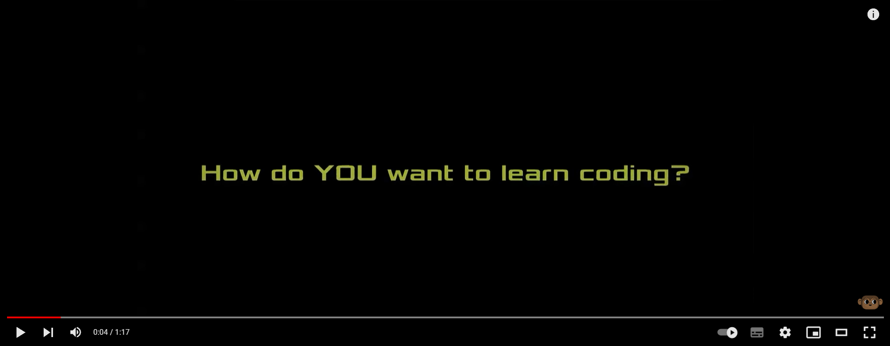
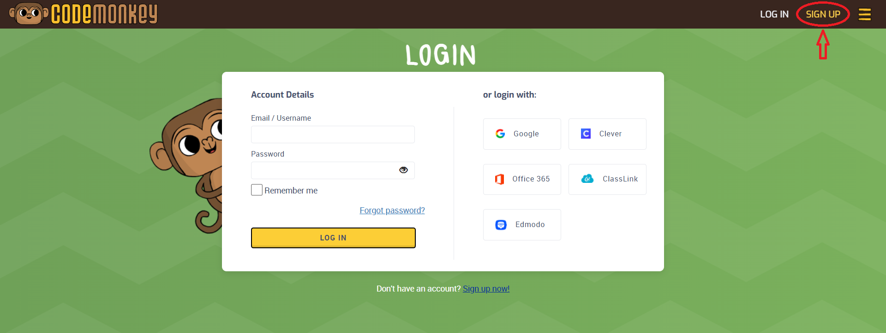
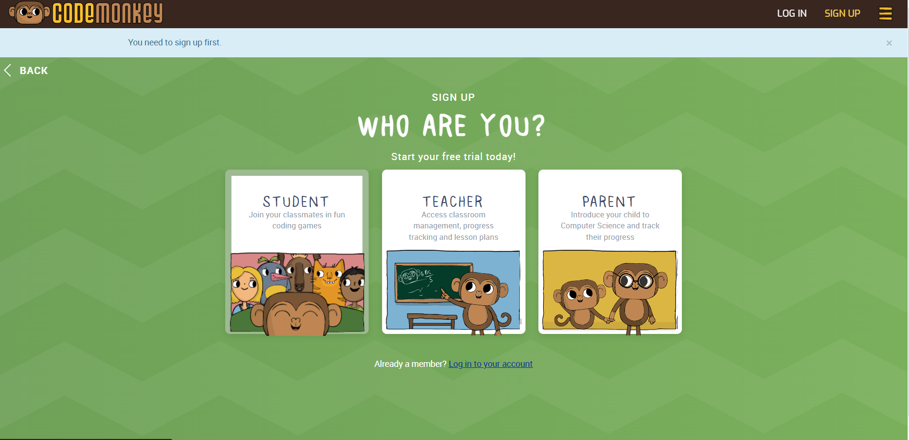
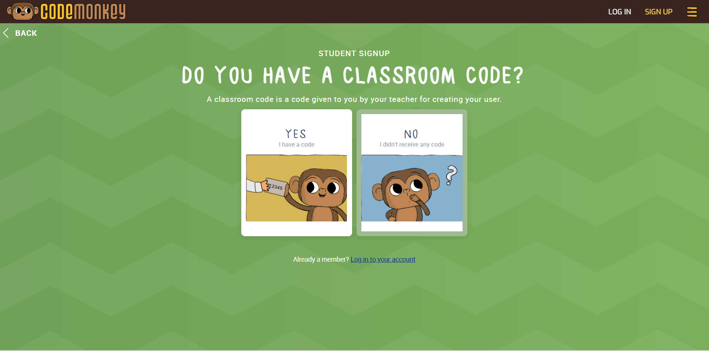
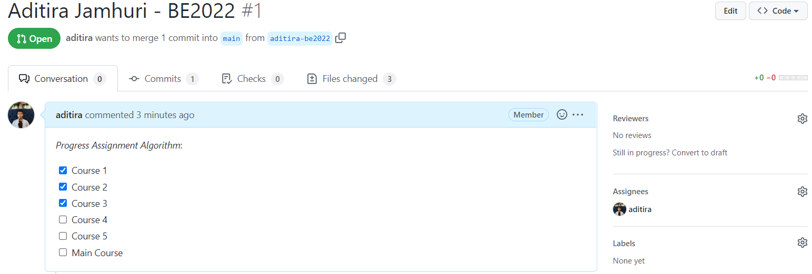
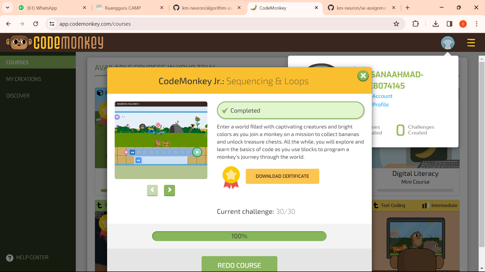
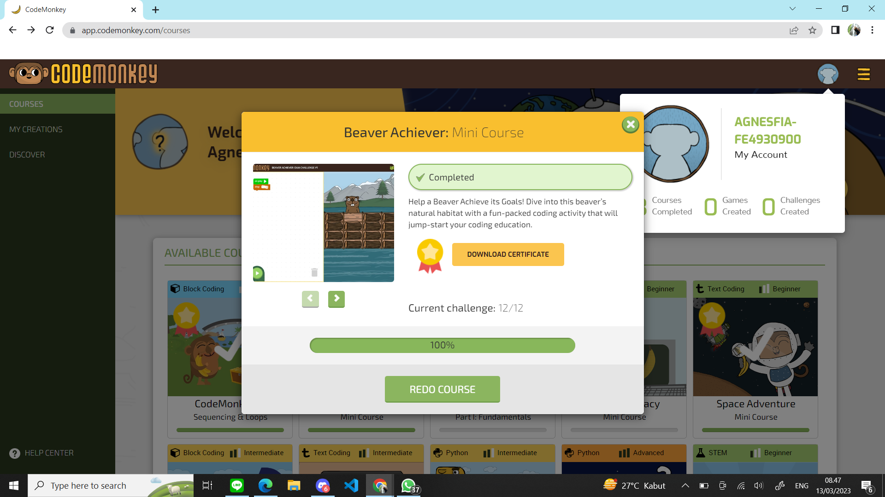
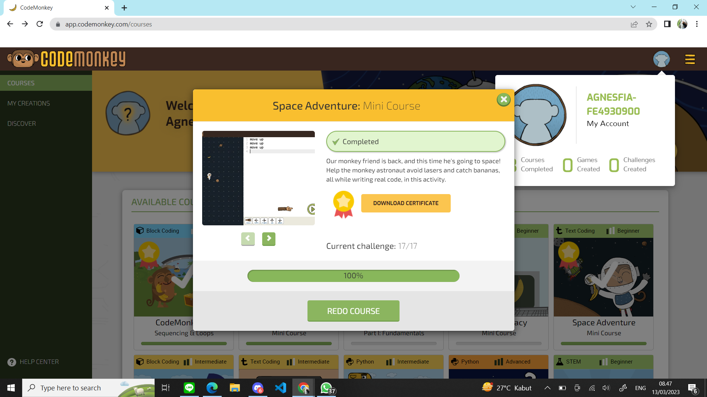
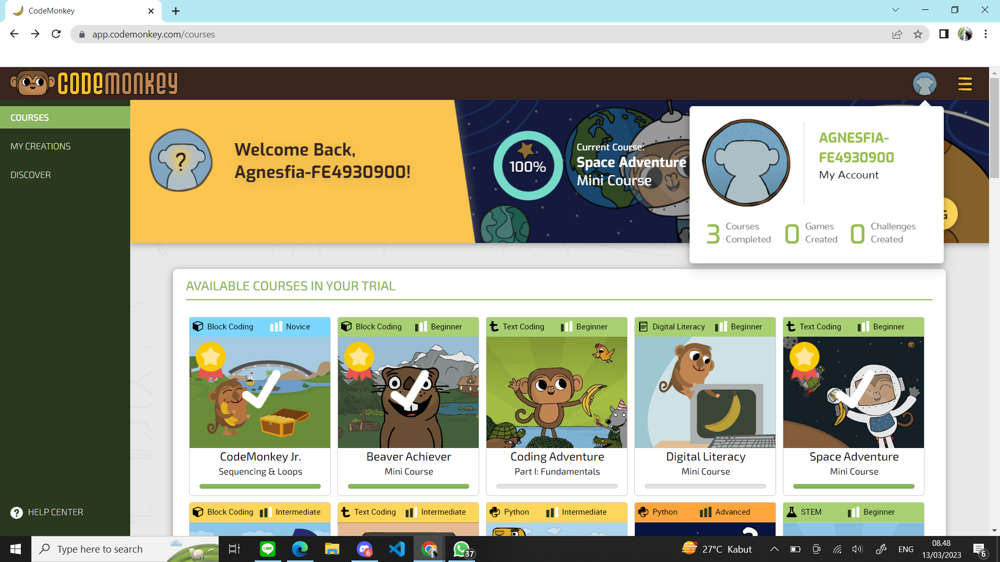

# Algorithm Assignment - Code Monkey

[](https://www.youtube.com/watch?v=RqSzdmSUHVo)

## Objectives

- Mengerti implementasi algoritma pemrograman melalui aplikasi game code monkey.
  - Sequencing & Loop
  - condition
  - real code

## Pre-requisite

- Sudah mempelajari materi **Algorithm** and **Pseoudo Code**.

## Register Steps

Berikut adalah cara untuk registrasi account code monkey: (ikuti langkah-langkah ini dengan baik dan benar!)

- Kunjungi halaman code monkey. Klik di sini: [app.codemonkey.com](https://app.codemonkey.com/login)
- Lalu klik tombol **Sign Up** di pojok kanan atas

  

- pada halaman _Who Are You?_, klik **STUDENT**.

  

- Pada halaman _Do You Have a Classroom Code?_, klik **NO**

  

- Pada halaman _Where Will You be Playing?_, klick **HOME**

  

- Pada halaman _HOW OLD ARE YOU?_, masukan umur kamu.
- Pada halaman _Form Sign Up_. Isi form sesuai dengan identitas yang benar.

  **Penting!**: Isi input _Display Name_ dengan format `<name> - <ID>`. Contoh: Aditira-BE2022

  

- Tekan tombol **Sign Up**

## Directions

Untuk mengerjakan Assignment Algorithm ini sangatlah mudah dan menyenangkan 😊. Kamu diminta untuk memainkan Game yang mengandung algoritma pemrograman dan step-step dalam menyelesaikan setiap tantangannya.

Dalam setiap course, kamu diminta untuk melakukan screenshoot dari setiap Card pada setiap topik course yang telah selesai dikerjakan. Course yang wajib dikerjakan yaitu:

- Ada di menu **Course**
- Course yang wajib dikerjakan adalah _Game course_ dengan judul:
  1. CodeMonkey Jr. (Sequencing & Loops)
  2. Beaver Achiever. (Mini Course)
  3. Space Adventure (Mini Course)

Dan terakhir kamu diminta untuk mengambil screenshoot di halaman utama **Course**. Cara melakukan screenshoot kamu wajib menampilkan **Display Name** dari setiap screenshoot dengan format `<name> - <id>`.

> **Note**: pastikan username dan id kamu benar!

Cara untuk menyimpan screenshootnya adalah sebagai berikut:

- Clonnig repository ini.
- Buat **branch** baru dengan format `<name> - <id>` (Contoh: aditira-be2022) dan checkout ke branch tersebut.
- Tambahkan **folder** baru di root repository dengan format `<name> - <id>`.
- Simpan semua screenshoot yang diminta pada folder tersebut dengan format file name:

  - `course1.png` untuk CodeMonkey Jr. (Sequencing & Loops)
  - `course2.png` untuk Beaver Achiever. (Mini Course)
  - `course3.png` untuk Space Adventure (Mini Course)
  - `main-course.png` untuk Halaman utama course

  Sebagai contoh pada folder **yourname-id**

  **Note**: pastika semua screenshoot Course memiliki status 100% complete, karena akan berpengaruh terhadap penilaian.

- Seteleh selesai atau ingin update yang sudah dikerjakan, lakukan **push** repository ini, lalu buat **Pull Request** dengan format:

  **Tittle**: `<fullname> - <id>`. Contoh: Aditira Jamhuri - BE2022

  **Description**:

  ```md
  _Progress Assignment Algorithm_:
  - [X] Course 1
  - [X] Course 2
  - [X] Course 3
  - [ ] Main Course
  ```

  - Contoh:

    

  - Contoh PR: klik [di sini](https://github.com/km-neutron/algorithm-assignment/pull/1)

  > Note: jika semua course sudah selesai untuk dikerjakan, lakukan **push** dan checklist semua _Progress Assignment Algorithm_ pada description **Pull Request**

## Restrictions

- Tidak boleh menampilkan jawaban di screenshot.

## Output

- Contoh screenshot 3 Course complete yang diminta:

  1. Code Monkey Jr

     

  2. Beaver Achiever

     

  3. Space Adventure

     

Overall Course



## Output yang harus disubmit ke LMS

- Link Pull Request (di repository ini, sesuai format)
